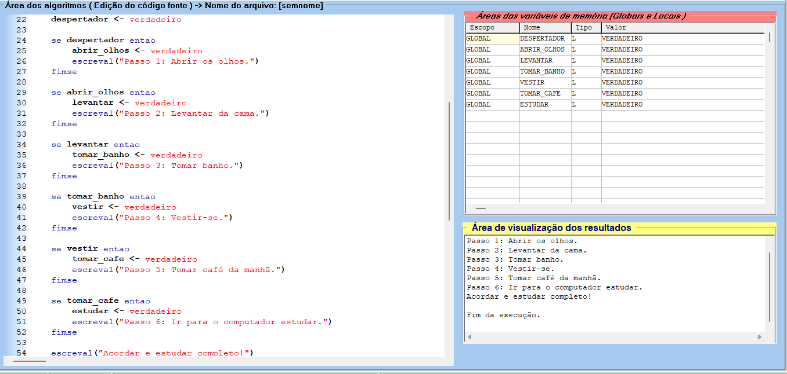

<!DOCTYPE html>
<html lang="pt-br">
<head>
    <meta charset="UTF-8">
    <meta name="viewport" content="width=device-width, initial-scale=1.0">
    <meta name="description" content="Descrição do Algoritmo Acordar e Estudar">
    <meta name="keywords" content="Visualg, Algoritmo, Acordar, Estudar">
    <meta name="author" content="Ana Alice Rodrigues">

</head>
<body>

<header>
    <h1>Algoritmo Acordar e Estudar</h1>
    
</header>

    
Índice

    <ol>
        <li><a href="#sobre-o-projeto">Sobre o projeto</a></li>
        <li><a href="#estrutura-do-algoritmo">Estrutura do Algoritmo</a></li>
        <li><a href="#como-executar-o-algoritmo">Como Executar o Algoritmo</a></li>
        <li><a href="#contato">Contato</a></li>
    </ol>

<section id="sobre-o-projeto">
    <h2>Sobre o projeto</h2>
    

        Este projeto consiste em um algoritmo criado no Visualg que simula o processo de acordar e se preparar para estudar.
        O algoritmo utiliza variáveis lógicas para representar diferentes etapas do processo matinal e exibe mensagens na tela conforme cada etapa é concluída.
    

</section>

<section id="estrutura-do-algoritmo">
    <h2>Estrutura do Algoritmo</h2>
    
O algoritmo está dividido em três principais passos:

    <ul>
        <li>Definir as variáveis necessárias.</li>
        <li>Inicializar as variáveis.</li>
        <li>Simular o processo de acordar e se preparar para estudar.</li>
    </ul>
    <h3>Passo 1: Definir as Variáveis Necessárias</h3>
    

        No início do algoritmo, definimos todas as variáveis lógicas que serão usadas para controlar cada etapa do processo matinal.
        As variáveis são:
    

    <ul>
        <li><code>despertador</code>: Indica se o despertador tocou.</li>
        <li><code>abrir_olhos</code>: Indica se os olhos foram abertos.</li>
        <li><code>levantar</code>: Indica se a pessoa se levantou da cama.</li>
        <li><code>tomar_banho</code>: Indica se a pessoa tomou banho.</li>
        <li><code>vestir</code>: Indica se a pessoa se vestiu.</li>
        <li><code>tomar_cafe</code>: Indica se a pessoa tomou café da manhã.</li>
        <li><code>estudar</code>: Indica se a pessoa está pronta para estudar.</li>
    </ul>
    <h3>Passo 2: Inicializar as Variáveis</h3>
    

        Antes de iniciar a simulação, todas as variáveis são inicializadas como <code>falso</code> para garantir que nenhum passo do processo tenha sido realizado antes do início do algoritmo.
    

    <h3>Passo 3: Simular o Processo de Acordar</h3>
    

        Nesta etapa, o algoritmo altera o valor das variáveis lógicas de acordo com as ações realizadas e exibe mensagens na tela para cada etapa completada.
        As etapas são:
    

    <ul>
        <li>O despertador toca.</li>
        <li>Abrir os olhos.</li>
        <li>Levantar da cama.</li>
        <li>Tomar banho.</li>
        <li>Vestir-se.</li>
        <li>Tomar café da manhã.</li>
        <li>Ir para o computador estudar.</li>
    </ul>
    

        O algoritmo utiliza instruções condicionais (<code>se...entao...fimse</code>) para verificar e atualizar o estado das variáveis e para exibir mensagens apropriadas na tela.
    

</section>

<section id="como-executar-o-algoritmo">
    <h2>Como Executar o Algoritmo</h2>
    <ol>
        <li>Abra o Visualg.</li>
        <li>Copie e cole o código acima em um novo arquivo no Visualg.</li>
        <li>Execute o algoritmo pressionando <code>F9</code> ou clicando no botão <code>Executar</code>.</li>
    </ol>
    
O algoritmo exibirá as mensagens de cada etapa do processo de acordar e se preparar para estudar na tela.

</section>

<section id="contato">
    <h2>Contato</h2>
    <ul>
        <li></li>
    </ul>
</section>

</body>
</html>
